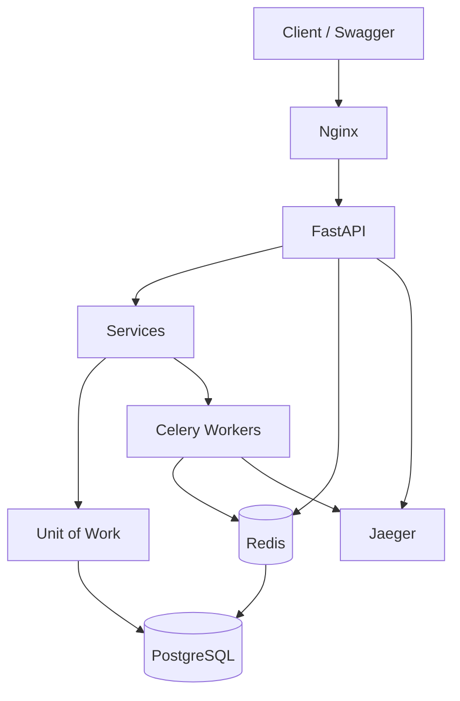
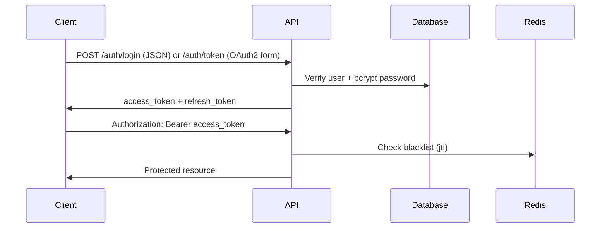

<div align="center">

# 💰 Expense Tracker API

**Production-grade REST API for personal finance — built to demonstrate senior backend engineering.**

[](https://www.python.org/)
[](https://fastapi.tiangolo.com/)
[](https://www.postgresql.org/)
[](https://redis.io/)
[](https://docs.celeryq.dev/)
[](https://docs.docker.com/compose/)
[](LICENSE)
[](CHANGELOG.md)

[Features](#features) · [Architecture](#architecture) · [Quick Start](#local-development) · [Docs](docs/README.md) · [Presentation](docs/presentation/index.html) · [PDF](docs/Expense_Tracker_API_Documentation_EN.pdf)


</div>

---

## Project Overview

**Expense Tracker API** is an enterprise-style backend for tracking expenses, income, transfers, budgets, and financial reports. It is designed as a **flagship portfolio project** showcasing:

- Clean layered architecture (Presentation → Application → Domain → Infrastructure)
- Async I/O with FastAPI + SQLAlchemy 2.x
- JWT authentication with refresh rotation and OAuth2 Swagger integration
- Celery background jobs (email, reports, receipts, maintenance)
- OpenTelemetry distributed tracing
- Docker-based dev/prod deployment with CI/CD

> **Version:** `1.0.0` · **Base path:** `/api/v1` · **OpenAPI:** `/docs` (when enabled)

---

## Features

| Category | Capabilities |
|----------|-------------|
| **Auth** | Register, JSON login, OAuth2 token (Swagger), refresh rotation, logout blacklist, password reset |
| **Transactions** | Expense / income / transfer CRUD, filters, pagination, soft delete, receipt upload |
| **Categories** | User + system categories with icons/colors |
| **Budgets** | Monthly limits, threshold alerts, spend summary |
| **Reports** | Async CSV + monthly exports via Celery task polling |
| **Audit** | Append-only trail, admin query API |
| **Observability** | Jaeger traces, Prometheus, Grafana, structured logging |
| **Ops** | Liveness/readiness probes, Nginx prod overlay, GHCR CI/CD |

<details>
<summary><strong>Legacy compatibility</strong></summary>

The `/api/v1/expenses` routes remain as a thin wrapper over transactions (`transaction_type=expense`). A PostgreSQL **VIEW** `expenses` preserves backward-compatible queries.

</details>

---

## Architecture



<details>
<summary><strong>Application layers</strong></summary>

| Layer | Components |
|-------|------------|
| Presentation | `app/api/v1/endpoints/*`, Pydantic schemas, `deps.py` |
| Application | Services, domain events, Celery tasks |
| Domain | Models, specifications |
| Infrastructure | Repositories, UoW, async sessions, Redis |

See [docs/architecture/architecture.md](docs/architecture/architecture.md) and [layered diagram](docs/assets/layered-architecture.svg).

</details>

---

## Technology Stack

| Layer | Technology |
|-------|------------|
| Runtime | Python 3.12 |
| Framework | FastAPI, Uvicorn |
| ORM | SQLAlchemy 2.x (async), Alembic |
| Database | PostgreSQL 16 |
| Cache / Queue | Redis 7, Celery |
| Auth | JWT (python-jose), bcrypt, OAuth2 password grant |
| Observability | OpenTelemetry → Jaeger, Prometheus, Grafana |
| Proxy | Nginx |
| CI/CD | GitHub Actions → GHCR |

---

## Folder Structure

```
Expense-Tracker-API/
├── app/                    # Application package
│   ├── api/                # Routes, deps, health
│   ├── core/               # Security, middleware, telemetry, errors
│   ├── db/                 # Session, UoW, Redis
│   ├── domain/             # Specifications
│   ├── events/             # Domain event bus + handlers
│   ├── models/             # SQLAlchemy models
│   ├── repositories/       # Data access layer
│   ├── schemas/            # Pydantic DTOs
│   ├── services/           # Business logic
│   ├── tasks/              # Celery tasks + beat schedule
│   └── main.py             # FastAPI entrypoint
├── alembic/                # Database migrations
├── docker/                  # Dockerfiles, nginx, prometheus
├── docs/                   # Documentation hub
│   ├── assets/             # SVG diagrams
│   ├── presentation/       # Interactive portfolio
│   └── Expense_Tracker_API_Documentation_EN.pdf
├── scripts/                # Deploy, PDF generation, seeds
├── tests/integration/        # Integration test suite
├── .github workflows/        # CI/CD
├── docker-compose.yml
├── docker-compose.prod.yml
└── pyproject.toml
```

---

## Database Design


| Table | Purpose |
|-------|---------|
| `users` | Identity, roles, profile |
| `categories` | Transaction classification |
| `transactions` | Financial records (expense/income/transfer) |
| `budgets` | Monthly spending limits per category |
| `refresh_tokens` | Hashed refresh token storage |
| `audit_logs` | Append-only compliance trail |

<details>
<summary><strong>Indexes & constraints</strong></summary>

- Partial index on active transactions (`deleted_at IS NULL`)
- GIN index on `tags` JSONB
- Composite `(user_id, transaction_date)` for reporting
- Check constraints on amounts, budget thresholds, transaction types

</details>

---

## Authentication Flow




| Endpoint | Format | Use case |
|----------|--------|----------|
| `POST /auth/login` | JSON `{email, password}` | API clients |
| `POST /auth/token` | Form `username=email, password` | **Swagger Authorize** |
| `POST /auth/refresh` | JSON `{refresh_token}` | Token rotation |
| `POST /auth/logout` | JSON + Bearer | Revoke session |

---

## Domain Events

| Event | Side effects |
|-------|-------------|
| `UserRegistered` | Welcome email (Celery), audit log |
| `TransactionCreated/Updated/Deleted` | Audit log |
| `BudgetThresholdExceeded` | Alert email, audit log |

Handlers live in `app/events/handlers.py` — decoupled from request path latency.

---

## Background Jobs


| Task | Schedule | Purpose |
|------|----------|---------|
| `evaluate_all_budgets` | Hourly (Beat) | Threshold scanning |
| `send_*_email` | On event | SMTP delivery |
| `export_transactions_csv` | On demand | CSV to `exports/` |
| `process_receipt_image` | On upload | Pillow processing |
| `cleanup_expired_tokens` | Daily | Token hygiene |

---

## Observability

| Tool | URL (dev) | Purpose |
|------|-----------|---------|
| Jaeger | http://localhost:16686 | Distributed traces |
| Flower | http://localhost:5555 | Celery monitoring |
| Prometheus | http://localhost:9090 | Metrics scrape |
| Grafana | http://localhost:3000 | Dashboards |

Health endpoints: `GET /api/v1/health/live` · `GET /api/v1/health/ready`

---

## API Modules

| Module | Prefix | Auth |
|--------|--------|------|
| Auth | `/auth` | Mixed |
| Users | `/users` | User / Admin |
| Transactions | `/transactions` | User |
| Expenses (legacy) | `/expenses` | User |
| Categories | `/categories` | User |
| Budgets | `/budgets` | User |
| Reports | `/reports` | User |
| Audit | `/audit` | Admin |
| Health | `/health` | Public |

Interactive docs: **http://localhost:8000/docs**

---

## Docker Setup

<details>
<summary><strong>Development stack</strong></summary>

```bash
cp .env.example .env
make run          # docker compose up -d
make migrate      # alembic upgrade head
make test         # 47 integration tests
```

| Service | Port |
|---------|------|
| API | 8000 |
| Nginx | 80 |
| Postgres | 5432 |
| Redis | 6379 |

</details>

<details>
<summary><strong>Production overlay</strong></summary>

```bash
export APP_VERSION=1.0.0
docker compose -f docker-compose.yml -f docker-compose.prod.yml --env-file .env.production up -d
```

- Multi-stage images, non-root user
- Shared `uploads/` + `exports/` volumes with Celery
- Nginx rate limiting + security headers
- `OPENAPI_ENABLED=false` recommended

</details>

---

## Environment Variables

| Variable | Description |
|----------|-------------|
| `SECRET_KEY` | JWT signing (32+ chars in prod) |
| `DB_*` | PostgreSQL connection |
| `REDIS_*` | Cache, Celery broker, blacklist |
| `CORS_ORIGINS` | Allowed origins (required in prod) |
| `OPENAPI_ENABLED` | Expose `/docs` |
| `SMTP_*` | Email delivery |
| `OTEL_EXPORTER_ENDPOINT` | Jaeger OTLP |

See [`.env.example`](.env.example) and [`.env.production.example`](.env.production.example).

---

## Local Development

```bash
# Prerequisites: Docker, Docker Compose, Make (optional)

git clone https://github.com/HusseinA-H/Expense-Tracker-API.git
cd Expense-Tracker-API
cp .env.example .env
make run && make migrate && make test
```

```bash
make lint       # black, isort, flake8
make logs       # follow container logs
make down     # stop stack
```

---

## Running Tests

```bash
make test
# or
docker compose exec api python -m pytest tests/integration -v
```

**47 integration tests** covering auth (incl. OAuth2), users, transactions, categories, budgets, audit, Celery wiring, and wiring wiring.

---

## CI/CD


| Workflow | Trigger | Actions |
|----------|---------|---------|
| `ci.yml` | PR / push | Lint, Postgres+Redis tests, GHCR build |
| `cd.yml` | Tag `v*.*.*` | Publish API + Celery images, deploy bundle |

---

## Deployment

```bash
bash scripts/deploy-staging.sh .env.staging
bash scripts/release-prepare.sh
git tag -a v1.0.0 -m "Release v1.0.0"
git push origin main --tags
```

Checklists: [staging](docs/deployment/staging-deployment.md) · [production](docs/deployment/production-readiness.md)

---

## Security

| Control | Implementation |
|---------|------------------|
| Password storage | bcrypt hashing |
| Tokens | HS256 JWT, refresh rotation, Redis blacklist |
| Transport | HTTPS via Nginx in production |
| Headers | CORS, TrustedHost, security headers |
| Surface | OpenAPI toggle, admin RBAC |
| Containers | Non-root runtime user |

Full review: [docs/security/SECURITY.md](docs/security/SECURITY.md)

---

## Screenshots

| Asset | Link |
|-------|------|
| System architecture | [docs/assets/system-architecture.svg](docs/assets/system-architecture.svg) |
| Database ERD | [docs/assets/database-erd.svg](docs/assets/database-erd.svg) |
| Interactive presentation | [docs/presentation/index.html](docs/presentation/index.html) |
| PDF documentation | [docs/Expense_Tracker_API_Documentation_EN.pdf](docs/Expense_Tracker_API_Documentation_EN.pdf) |

---

## Architecture Diagrams

Additional diagrams in [docs/assets/](docs/assets/):

- [Authentication flow](docs/assets/auth-flow.svg)
- [Layered architecture](docs/assets/layered-architecture.svg)
- [CI/CD pipeline](docs/assets/cicd-pipeline.svg)
- [Observability stack](docs/assets/observability-stack.svg)

Full mermaid docs: [docs/architecture/architecture.md](docs/architecture/architecture.md)

---

## Future Roadmap

- [ ] API v2 when breaking changes are planned
- [ ] Kubernetes Helm chart
- [ ] Unit test layer (`tests/unit/`)
- [ ] Real CD smoke tests against staging
- [ ] Rate limiting middleware
- [ ] OpenAPI client SDK generation

---

## Why This Project Matters

This is not a tutorial CRUD app. It demonstrates **production backend ownership**:

1. **Architecture** — strict layers, UoW, repository pattern, domain events
2. **Security** — JWT lifecycle, OAuth2 Swagger fix, hardening matrix
3. **Async & scale** — async DB, Celery offload, read replica support
4. **DevOps** — Docker prod overlay, CI/CD, health probes, GHCR
5. **Quality** — 47 integration tests, lint pipeline, structured errors
6. **Observability** — OpenTelemetry end-to-end

Suitable for **technical interviews**, **engineering manager reviews**, and **portfolio showcases**.

---

## Resume Highlights

> *Designed and implemented a production FastAPI backend with JWT auth, Celery background jobs, and OpenTelemetry tracing. Built CI/CD pipelines, multi-stage Docker deployment, and 47 integration tests. Authored enterprise documentation and interactive portfolio presentation.*

---

## Documentation

| Resource | Description |
|----------|-------------|
| [Documentation hub](docs/README.md) | Index of all docs |
| [Architecture](docs/architecture/architecture.md) | Deep-dive diagrams |
| [Security](docs/security/SECURITY.md) | Hardening review |
| [Contributing](CONTRIBUTING.md) | Contribution guide |
| [Changelog](CHANGELOG.md) | Version history |

Generate PDF locally:

```bash
python scripts/generate_documentation_pdf.py --lang en
```

---

## License

[MIT License](LICENSE) — Copyright © 2026 Hussein A-H

---

<div align="center">

**⭐ Star this repo if it helped your learning or interview prep**

[Report Bug](https://github.com/HusseinA-H/Expense-Tracker-API/issues) · [Request Feature](https://github.com/HusseinA-H/Expense-Tracker-API/issues)

</div>
