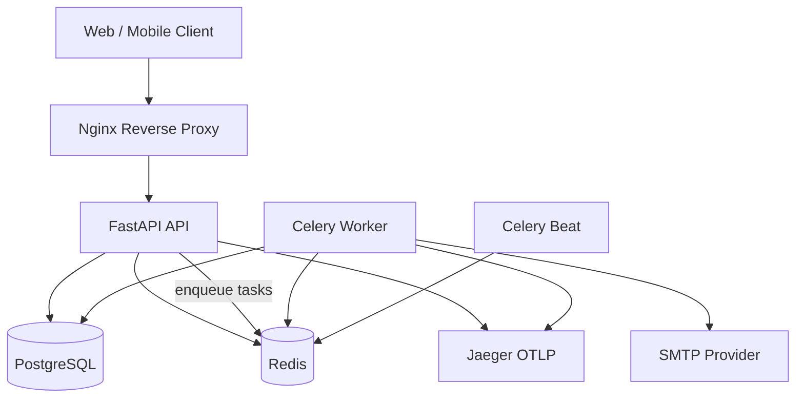
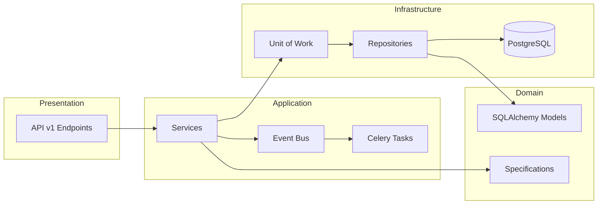
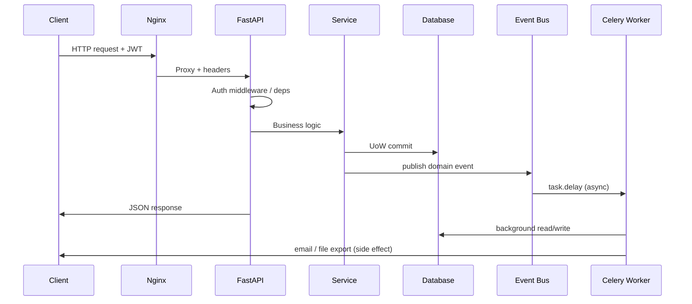
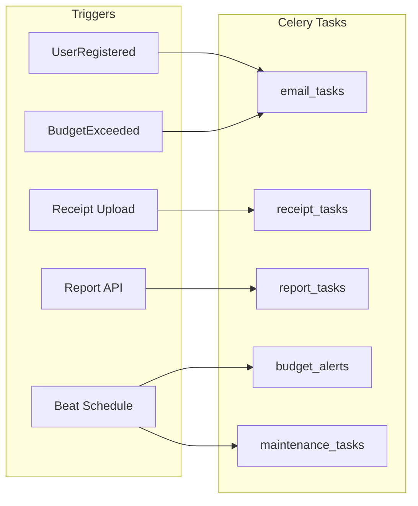
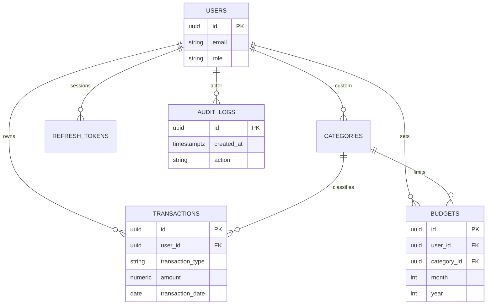
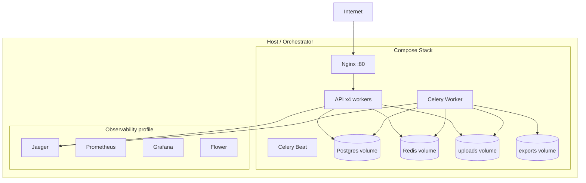

# Architecture

Expense Tracker API v1 — component and deployment views for release candidate `1.0.0-rc.1`.

---

## System context



---

## Application layers



---

## Request lifecycle (authenticated)



---

## Background jobs



---

## Data model (core entities)



---

## Deployment topology (production)



---

## Export diagram (PNG/SVG)

To export diagrams for Confluence/wiki:

1. Open [Mermaid Live Editor](https://mermaid.live)
2. Paste a diagram block from this document
3. Export as PNG or SVG

Alternatively, use `@mermaid-js/mermaid-cli`:

```bash
npx @mermaid-js/mermaid-cli -i docs/architecture/architecture.md -o docs/assets/
```

---

## Related documents

- [README.md](../README.md)
- [SECURITY.md](SECURITY.md)
- [deployment/staging-deployment.md](../deployment/staging-deployment.md)
- [deployment/production-readiness.md](../deployment/production-readiness.md)
